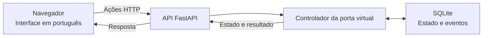

# Arquitetura da base

O EverLock é uma aplicação local única, organizada em módulos. O backend usa Python e FastAPI, a interface usa HTML, CSS e JavaScript e a persistência usa SQLite. Não são necessários serviços em nuvem para esta entrega.

## Autoridade sobre o estado

O controlador no servidor determina se uma ação é permitida. A interface apresenta a resposta e não pode autorizar uma abertura alterando apenas seus próprios elementos.

Porta e trava são informações distintas. Uma porta aberta continua aberta quando a liberação termina. O estado correspondente é aguardar fechamento, não afirmar que a entrada está protegida.

As regras iniciais são:

- A entrada externa exige liberação ativa, exceto pela chave virtual.
- Uma liberação dura três segundos e pode ser encerrada antes do prazo.
- Abrir a porta e liberar a trava são ações separadas.
- A saída interna e a chave virtual permitem abertura independentemente da liberação.
- Fechar a porta permite o engate quando não há liberação ativa.

As ações manuais deste protótipo representam comportamento mecânico. Elas não controlam equipamento real.

## Tempo e persistência

A duração da liberação utiliza o relógio monotônico do servidor, que mede intervalos. Ela não depende de a aba do navegador continuar aberta e não é prolongada por mudanças no relógio de calendário.

O SQLite guarda o estado e o histórico de eventos. Após reiniciar, a aplicação recupera a última posição da porta, mas encerra qualquer liberação anterior. Um estado salvo não deve provocar uma nova abertura.

A base usa uma única instância do controlador. Executar vários processos de servidor sobre o mesmo banco exigiria coordenação adicional e está fora desta etapa.

## Evolução prevista

Os próximos módulos acrescentarão o cálculo de energia, as contas e permissões, a comunicação simulada e o reconhecimento facial. O reconhecimento produzirá uma possível identidade; o controlador continuará responsável por verificar autorização antes de liberar a porta.

No módulo de conectividade, será necessário distinguir a verdade interna do simulador da última observação recebida pelo gerenciamento. Essa separação ainda não representa uma funcionalidade entregue.

A integração opcional com n8n receberá eventos para alertas e relatórios. Ela não participará da decisão de acesso nem será necessária ao funcionamento da porta virtual.
