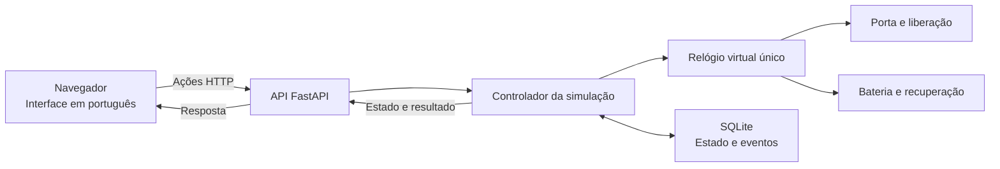

# Arquitetura da base

O EverLock é uma aplicação local única, organizada em módulos. O backend usa Python e FastAPI, a interface usa HTML, CSS e JavaScript e a persistência usa SQLite. Não são necessários serviços em nuvem para esta entrega.

## Autoridade sobre o estado

O controlador no servidor determina se uma ação é permitida. A interface apresenta a resposta e não pode autorizar uma abertura alterando apenas seus próprios elementos.

Porta e trava são informações distintas. Uma porta aberta continua aberta quando a liberação termina. O estado correspondente é aguardar fechamento, não afirmar que a entrada está protegida.

As regras iniciais são:

- A entrada externa exige liberação ativa, exceto pela chave virtual.
- Uma liberação dura três segundos e pode ser encerrada antes do prazo.
- Abrir a porta e liberar a trava são ações separadas.
- A saída interna e a chave virtual permitem abertura independentemente da liberação.
- Fechar a porta permite o engate quando não há liberação ativa.

As ações manuais deste protótipo representam comportamento mecânico. Elas não controlam equipamento real.

## Tempo e persistência

O relógio monotônico do servidor alimenta um relógio virtual único para porta, energia e recuperação. Ele suporta pausa, velocidades 1×/60×/600× e avanço manual quando pausado. Não depende da aba aberta nem do relógio de calendário. Futuras sessões de autenticação usarão tempo real.

O SQLite grava porta, energia, relógio e eventos na mesma transação. A migração adiciona tabelas e campos sem apagar o histórico anterior. Após reiniciar, recupera o cenário, encerra liberações e pausa o tempo em 1×. Não calcula retrospectivamente o intervalo com a aplicação fechada. A descrição dos pontos de salvamento e suas limitações está em [energy.md](energy.md).

O desligamento virtual não encerra o servidor real: os controles do laboratório continuam acessíveis para restaurar energia e demonstrar operações manuais. Esses dados representam a visão interna do simulador, e não telemetria recebida de um equipamento sem alimentação.

## Aparência

O botão sol/lua escolhe tema claro ou escuro. A preferência fica apenas no navegador; na primeira visita, segue a configuração do sistema. A troca não altera o estado da porta nem depende da API.

A base usa uma única instância do controlador. Executar vários processos de servidor sobre o mesmo banco exigiria coordenação adicional e está fora desta etapa.

## Evolução prevista

Os próximos módulos acrescentarão contas e permissões, comunicação simulada e reconhecimento facial. O reconhecimento produzirá uma possível identidade; o controlador continuará responsável por verificar autorização antes de liberar a porta.

No módulo de conectividade, será necessário distinguir a verdade interna do simulador da última observação recebida pelo gerenciamento. Essa separação ainda não representa uma funcionalidade entregue.

A integração opcional com n8n receberá eventos para alertas e relatórios. Ela não participará da decisão de acesso nem será necessária ao funcionamento da porta virtual.
