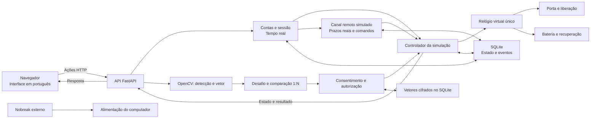

# Arquitetura da base

O EverLock é uma aplicação local única, organizada em módulos. O backend usa Python e FastAPI, a interface usa HTML, CSS e JavaScript e a persistência usa SQLite. Não são necessários serviços em nuvem para esta entrega.

```mermaid
flowchart LR
    Browser["Navegador\nInterface em português"] -->|"Ações HTTP"| API["API FastAPI"]
    API --> Auth["Contas e sessão\nTempo real"]
    Auth --> Controller["Controlador da simulação"]
    Auth --> Communication["Canal remoto simulado\nPrazos reais e comandos"]
    API --> Faces["OpenCV: detecção e vetor"]
    Faces --> Recognition["Desafio e comparação 1:N"]
    Recognition --> Identities["Consentimento e autorização"]
    Identities --> Controller
    Identities <--> Vault["Vetores cifrados no SQLite"]
    Communication --> Controller
    Communication <--> Store
    Controller --> Clock["Relógio virtual único"]
    Clock --> Door["Porta e liberação"]
    Clock --> Power["Bateria e recuperação"]
    Controller <--> Store["SQLite\nEstado e eventos"]
    Auth <--> Store
    UPS["Nobreak externo"] --> PC["Alimentação do computador"]
    Controller -->|"Estado e resultado"| API
    API -->|"Resposta"| Browser
```

## Autoridade sobre o estado

O controlador no servidor determina se uma ação é permitida. A interface apresenta a resposta e não pode autorizar uma abertura alterando apenas seus próprios elementos.

Porta e trava são informações distintas. Uma porta aberta continua aberta quando a liberação termina. O estado correspondente é aguardar fechamento, não afirmar que a entrada está protegida.

As regras iniciais são:

- A entrada externa exige liberação ativa, exceto pela chave virtual.
- Uma liberação dura três segundos e pode ser encerrada antes do prazo.
- Abrir a porta e liberar a trava são ações separadas.
- A saída interna e a chave virtual permitem abertura independentemente da liberação.
- Fechar a porta permite o engate quando não há liberação ativa.

As ações manuais deste protótipo representam comportamento mecânico. Elas não controlam equipamento real.

## Tempo e persistência

O relógio monotônico do servidor alimenta um relógio virtual único para porta, energia e recuperação. Ele suporta pausa, velocidades 1×/60×/600× e avanço manual quando pausado. Não depende da aba aberta nem do relógio de calendário. Sessões, limites de login e validade das leituras do nobreak usam tempo real independente; avançar um dia virtual não vence nem prolonga uma sessão.

O SQLite grava porta, energia, relógio e eventos na mesma transação. A migração adiciona tabelas e campos sem apagar o histórico anterior. Após reiniciar, recupera o cenário, encerra liberações e pausa o tempo em 1×. Não calcula retrospectivamente o intervalo com a aplicação fechada. A descrição dos pontos de salvamento e suas limitações está em [energy.md](energy.md).

O desligamento virtual não encerra o servidor real: os controles do laboratório continuam acessíveis para restaurar energia e demonstrar operações manuais. Esses dados representam a visão interna do simulador, e não telemetria recebida de um equipamento sem alimentação.

## Aparência

O botão sol/lua escolhe tema claro ou escuro. A preferência fica apenas no navegador; na primeira visita, segue a configuração do sistema. A troca não altera o estado da porta nem depende da API.

A base usa uma única instância do controlador. Executar vários processos de servidor sobre o mesmo banco exigiria coordenação adicional e está fora desta etapa.

## Contas e nobreak

`accounts.py` cuida de senhas, sessões, papéis e auditoria. `auth_api.py` protege as ações. A mesma trava de concorrência serializa autorização, revogação e alterações da porta. Tabelas de contas são separadas de eventos e estado físico virtual; as identidades biométricas têm entidades próprias (`identities.py`, `identity_api.py`, `recognition.py`) e nenhuma ligação com as contas. Consulte [accounts.md](accounts.md) e [identities.md](identities.md).

O nobreak comprado alimentará o computador, sem integração ao EverLock. A seção Status Nobreak informa a ausência de monitoramento; os testes virtuais ficam recolhidos. `GET /api/ups` permanece como resposta informativa de compatibilidade, sem observações nem controles. O antigo módulo `ups.py` não é carregado pela aplicação. Consulte [ups.md](ups.md).

## Evolução prevista

O módulo de identidades guarda consentimento, retenção e horário. `recognition.py` mantém o teste simulado separado do pipeline real: o OpenCV produz uma possível identidade somente depois de um desafio de giro, `evaluate()` decide se ela está autorizada e o controlador continua sendo o único responsável por liberar a trava. As imagens ficam apenas em memória; os vetores persistidos são cifrados.

O módulo de comunicação já separa a verdade interna (`/api/status`) da última observação remota (`/api/communication`). Internet, rede local e energia têm estados próprios. UUID, prazo monotônico real, verificação de versão e revalidação da sessão protegem cada comando; a decisão final e a atuação compartilham uma transação SQLite. Falhas cancelam os pendentes, sem fila após reconexão. Consulte [communication.md](communication.md).

A integração opcional com n8n recebe eventos para alertas em uma fila de segundo plano. Ela não participa da decisão de acesso nem é necessária ao funcionamento da porta virtual. Relatórios periódicos permanecem pendentes.

`evaluation.py` e `scripts/avaliar_rostos.py` avaliam imagens autorizadas fora do aplicativo, com conjuntos separados. O relatório registra métricas e limites usados; a ferramenta não cria identidades nem altera os limites de autorização.
