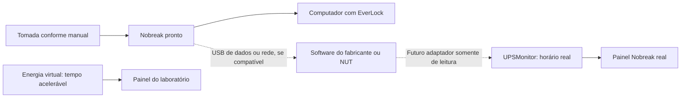

# Nobreak real: preparação da integração

## Mudança confirmada em 26/09/2026

O grupo informou que comprará um nobreak pronto. Esse é o único componente físico adicional previsto. Porta, trava e sensores continuam virtuais; não haverá circuito de fechadura ou montagem elétrica. A compra passa a ser uma exceção ao objetivo anterior de custo zero. Não há modelo, preço, duração mínima ou equipamento anfitrião definidos.

## Alimentação e monitoramento são entregas diferentes

1. **Alimentar o computador:** conectar conforme o manual e demonstrar continuidade do programa durante uma interrupção controlada. Pode funcionar mesmo sem comunicação com o EverLock.
2. **Ler o nobreak:** depende de modelo, sistema operacional e interface de dados compatíveis. USB de carregamento não comprova telemetria. Sem comunicação, carga e autonomia ficam desconhecidas.

A bateria virtual permanece independente, em `power` e `/api/simulation/*`. Seus Wh e seus limiares não representam medições do nobreak. O módulo `ups.py` prepara um contrato de observação real, consultado em `GET /api/ups`; não há driver instalado, descoberta USB, leitura física nem controle de tomadas nesta versão.

## Arquitetura proposta

O [Network UPS Tools (NUT)](https://networkupstools.org/docs/user-manual.chunked/Overview.html) é um candidato de integração: usa drivers, servidor e clientes, com suporte dependente do equipamento. A escolha entre NUT e software do fabricante fica condicionada ao modelo e ao sistema; não foi assumida compatibilidade com Windows ou com qualquer nobreak genérico. Consultar documentação e licença da versão adotada antes da implementação.

## Contrato já preparado

- Origem fixa `real_ups`, distinta do estado matemático.
- Estados `not_configured`, `available`, `stale` e `unavailable`.
- Observação com horário real e fuso, modelo, presença de rede, carga percentual e autonomia reportada. Campos não fornecidos permanecem nulos.
- Leitura com idade de 15 segundos ou mais fica desatualizada. Esse limite provisório pressupõe futura coleta a cada 5 segundos; validar após escolher o adaptador.
- Falha de coleta pode conservar a última leitura, mas nunca a apresenta como atual. Observações mais antigas são ignoradas; horários futuros são recusados.
- Nenhuma rota aceita valores manuais para apresentá-los como medição real. O contrato é alimentado internamente apenas pelo futuro adaptador.
- Pausar/acelerar o simulador não altera a idade da leitura real. Falha do monitor não muda a porta.

O futuro coletor deverá usar timeout curto, cache e reconexão limitada, fora da trava principal do simulador. Inicialmente será somente de leitura, com permissões mínimas e serviço local; credenciais e endereços não serão publicados. A aplicação não enviará desligamento, teste de bateria ou corte de saída ao nobreak.

## O que confirmar antes de integrar

- Marca, modelo exato e revisão; manual e software oficial.
- Sistema operacional do computador e interface de dados disponível.
- Potência real da carga em W, limite de W e VA do nobreak, tensão, conectores e compatibilidade da fonte do computador, conforme fabricantes.
- Duração pretendida e necessidade de manter monitor/roteador ligados. Nobreak do computador não garante internet, nem alimentação do provedor.
- Campos que o equipamento realmente fornece; data/hora e qualidade das estimativas.

VA é capacidade de potência aparente, não reserva de energia. Não se obtém autonomia só com VA, e Ah sem tensão não descreve Wh. A autonomia real depende da carga, bateria, conversão e envelhecimento; será medida, sem reaproveitar a estimativa virtual de 40 Wh.

## Etapas e aceite

1. Registrar modelo, carga e manual; confirmar que a compra atende alimentação e, se desejado, telemetria.
2. Manter a distinção real/virtual no código e nas telas (preparada nesta versão).
3. Validar driver e coletar somente os campos suportados; testar desconexão de dados, reconexão e leitura antiga com amostras de teste identificadas.
4. Com equipamento disponível, fazer teste supervisionado segundo o manual: registrar carga inicial, início/fim da interrupção, continuidade do servidor, retorno da rede e integridade do banco. Não abrir equipamento nem fazer montagem de rede elétrica.
5. Configurar encerramento seguro no software suportado pelo fabricante/sistema. Testar com arquivos salvos e reserva suficiente; não forçar esgotamento para uma apresentação.
6. Registrar duração observada, condições e limites. Na retomada, preservar banco e contas e não repetir liberação anterior.

**Demonstração:** primeiro executar cenários virtuais; depois identificar claramente o teste de alimentação real. O grupo opera o equipamento conforme o manual. Comprar o nobreak não comprova leitura de carga, tempo garantido de autonomia ou funcionamento remoto durante uma falha da internet.
